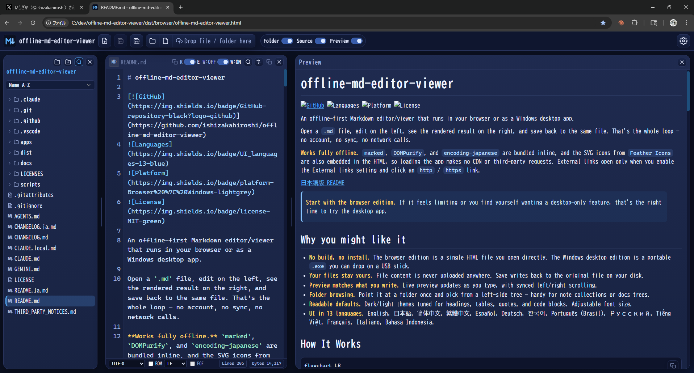
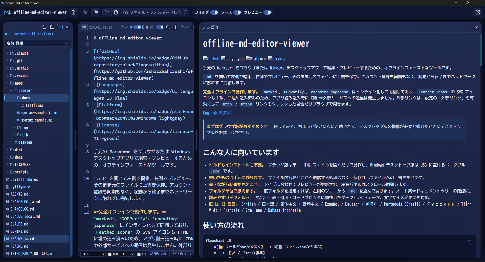
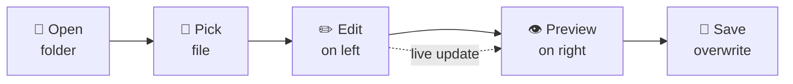

# offline-md-editor-viewer

[](https://github.com/ishizakahiroshi/offline-md-editor-viewer)


<p>
  
  
</p>

## Demo

https://github.com/user-attachments/assets/00d80cbc-ca93-4cfd-86d3-5299895d06b7

An offline-first Markdown editor/viewer that runs in your browser or as a Windows desktop app.

Open a `.md` file, edit on the left, see the rendered result on the right, and save back to the same file. That's the whole loop — no account, no sync, no network calls.

**Works fully offline.** `marked`, `DOMPurify`, and `encoding-japanese` are bundled inline, and the SVG icons from `Feather Icons` are also embedded in the HTML, so loading the app makes no CDN or third-party requests. External links open only when you enable the External links setting and click an `http` / `https` link.

[日本語版 README](./README.ja.md)

> **Start with the browser edition.** If it feels limiting or you find yourself wanting a desktop-only feature, that's the right time to try the desktop app.

## Quick Download

Get the latest files from [GitHub Releases](https://github.com/ishizakahiroshi/offline-md-editor-viewer/releases/latest).

| Want to... | Download |
| --- | --- |
| Try it quickly in Chrome | `offline-md-editor-viewer.html` |
| Run it as a Windows app | `offline-md-editor-viewer.exe` |
| Archive or redistribute the browser edition | `offline-md-editor-viewer-browser-vX.X.X.zip` |
| Archive or redistribute the Windows edition | `offline-md-editor-viewer-desktop-vX.X.X-win-x64-portable.zip` |

## Why you might like it

- **No build, no install.** The browser edition is a single HTML file you open directly. The Windows desktop edition is a portable `.exe` you can drop on a USB stick.
- **Your files stay yours.** File content is never uploaded anywhere. Save writes back to the original file on your disk.
- **Preview matches what you write.** Live preview updates as you type, with synced left/right scrolling.
- **Folder browsing.** Point it at a folder once and pick from a left-side tree — handy for note collections or docs trees.
- **Readable defaults.** Dark/light themes tuned for headings, tables, quotes, and code blocks. Adjustable font size.
- **UI in 13 languages.** English, 日本語, 简体中文, 繁體中文, Español, Deutsch, 한국어, Português (Brasil), Русский, Tiếng Việt, Français, Italiano, Bahasa Indonesia.

## Security / Privacy

- **No file uploads.** Markdown files are read and rendered locally in your browser or desktop WebView.
- **No CDN.** Runtime libraries and icons are bundled with the app.
- **No app network calls.** Release builds use `connect-src 'none'` in the Content Security Policy.
- **External links are opt-in.** `http` / `https` links open only when you enable the External links setting and click a link.

## How It Works



Edits on the left source pane update the right preview pane in real time. `Save (Overwrite)` writes back to the original file. You can also open a single file without choosing a folder.

In edit mode, use `Ctrl/Cmd+F` to open the floating find bar and `Ctrl/Cmd+H` or `Ctrl/Cmd+R` to expand replace controls. `Enter` moves to the next match, `Shift+Enter` moves to the previous match, and `Esc` closes the bar. The find bar supports case-sensitive, whole-word, and regular-expression search.

## Use in the Browser

Two options on the [GitHub Releases](https://github.com/ishizakahiroshi/offline-md-editor-viewer/releases) page:

1. **`offline-md-editor-viewer.html`** — single file, ideal for a quick try. Download and open it directly in Chrome.
2. **`offline-md-editor-viewer-browser-vX.X.X.zip`** — includes README, CHANGELOG, LICENSE, and LICENSES/. Recommended for archiving or redistribution.

The standalone HTML is completely self-contained: `marked`, `DOMPurify`, `encoding-japanese`, and the `Feather Icons` SVG set are all bundled inline. No extra folders needed — open the file and it works offline. You can verify the full license texts anytime via the About dialog → **Show full license texts**.

1. Download `offline-md-editor-viewer.html` (or extract it from the browser ZIP) and open it in Google Chrome (double-click or drag & drop onto Chrome)
2. Load a `.md` file (drag & drop or file picker)
3. Edit on the left, then click `Save (Overwrite)`

> **If you cloned the repository:** Open `apps/browser/offline-md-editor-viewer.html` and keep `apps/browser/lib/` next to it. The source HTML loads its bundled libraries from that folder; removing `lib/` will break Markdown rendering. Note that the "Show full license texts" link in About shows empty content in the source version — full license texts are only embedded in release builds. Use the `LICENSES/` directory directly for license files.

Recommended on macOS and Linux for now — native desktop packages are currently Windows-only.

## Use the Windows Desktop App

Two options on the [GitHub Releases](https://github.com/ishizakahiroshi/offline-md-editor-viewer/releases) page:

1. **`offline-md-editor-viewer.exe`** — single portable file, ideal for a quick try. Download and run it directly — no installation required.
2. **`offline-md-editor-viewer-desktop-vX.X.X-win-x64-portable.zip`** — includes README, CHANGELOG, LICENSE, and LICENSES/. Recommended for archiving or redistribution.

The exe is portable: no installation required, and it runs from a USB drive. The desktop app loads the same single HTML used by the browser edition inside a Tauri WebView, so both editions share identical frontend code. The About dialog → **Show full license texts** reveals the full license texts for all web dependencies (marked, DOMPurify, encoding-japanese, Feather Icons) as well as every Tauri/Rust crate license statically linked into the exe.

- Double-click `offline-md-editor-viewer.exe` to launch (no installation required)
- Open a file or folder from the toolbar, then edit and save

Folder access is smoother than the browser edition: the last folder path is remembered and reopened without re-prompting. If you do not need to carry settings over, the exe works by itself. On first launch, an `offline-md-editor-viewer-userdata/` directory is created next to the exe for WebView2 user data. To carry settings to another PC or USB drive, move the exe and `offline-md-editor-viewer-userdata/` together. Unsigned executables may show a SmartScreen warning on first launch.

macOS and Linux desktop packages are planned for later. Use the browser edition on those platforms in the meantime.

## Self-hosting (optional)

This app is primarily designed for offline use, but you can also place the single-file `offline-md-editor-viewer.html` from a release ZIP on a web server and access it via URL. Drop a Markdown file into the browser to render a formatted preview.

Even when served from a web server, the app's own scripts perform no external requests; files are processed entirely within the local browser (enforced by `Content-Security-Policy: connect-src 'none'`).

## Browser vs. Desktop

Editing, rendering, and preview share the same HTML on both editions, so **the core functionality is identical**. The differences below come from the environment (OS integration vs. browser sandboxing).

| Aspect | Browser | Desktop |
| --- | :---: | :---: |
| Direct access to protected folders (Desktop / Documents / Downloads, etc.) | | ✓ |
| Reopens the last folder without a re-permission prompt | | ✓ |
| Portable settings (move the exe together with `offline-md-editor-viewer-userdata/` to keep language, theme, etc.) | | ✓ |
| Parent folder tree shown when opening/dropping a single file | | ✓ |
| File-association launch (right-click → "Open with" in Explorer) | | ✓ |
| Explorer integration (click the folder path to open it) | | ✓ |
| Folder drag & drop | ✓ | ✓ |
| Create / rename / delete files and folders in the tree | ✓ (standard in Chrome via File System Access API) | ✓ |
| Moving files and folders inside the tree by drag & drop | ✓ (standard in Chrome via File System Access API) | ✓ |
| Copy external files/folders into the opened tree by drag & drop | ✓ (standard in Chrome via File System Access API) | ✓ |

## Build the Windows Desktop App

Prerequisites: Node.js, Rust stable, Microsoft C++ Build Tools, and WebView2 Runtime on Windows.
The Tauri CLI is installed locally by `npm ci` via `@tauri-apps/cli`, so no global Tauri install is required.

```powershell
cd apps/desktop
npm ci
npm run dev
npm run build
```

`npm run dev` opens the Tauri development window. `npm run build` produces a portable executable at `apps/desktop/src-tauri/target/release/offline-md-editor-viewer.exe` (no installer is generated).

> If you only want to use the app, just run the distributed `offline-md-editor-viewer.exe` directly. The build steps above are for people who want to try building it in their own local environment.

## Supported File Types

Any non-binary file can be opened, edited, and saved. The file type determines whether a live preview is shown.

### Markdown — full live preview

- `.md`, `.markdown`

### All other text files — no preview (source pane only; editable and savable)

Any file that is not binary (not an image, compiled binary, archive, etc.) opens in the source pane as plain text. Examples include:

- Documents: `.txt`, `.log`, `.rst`, `.adoc`
- Source code: `.js`, `.ts`, `.py`, `.go`, `.sh`, `.rb`, `.java`, `.c`, `.cpp`, and so on
- Config: `.json`, `.yml`, `.yaml`, `.toml`, `.ini`, `.conf`, `.xml`
- Data: `.csv`, `.tsv`
- Database / diff: `.sql`, `.diff`, `.patch`
- Environment: `.env` and any `.env.*` (e.g., `.env.local`, `.env.production`)
- Dotfiles: `.gitignore`, `.gitattributes`, `.editorconfig`, `.dockerignore`, `.npmrc`, `.prettierrc`, `.eslintrc`

When a non-Markdown file is opened, the right-side preview shows a notice that preview is not available for that file type; the left-side source pane still shows and edits the raw text.

## Sample Files

- Markdown syntax samples live in `apps/browser/docs/`.
- Open this repository with `Folder`, then choose `apps/browser/docs/syntax-sample.md` or `apps/browser/docs/syntax-sample.ja.md` from the left-side list.

## Folder List

- Use `Folder` to show folders and supported text files in the left-side tree.
- The browser and Windows desktop editions both show nested folders; click a folder row to expand or collapse it.
- Drag files or folders inside the tree to move them into another folder, or onto empty tree space to move them to the opened root folder. In Chrome, the browser edition uses the standard File System Access API for writable folders, so moving works after you open a folder with write permission. Read-only legacy folder drops may not support moving.
- The folder picker starts from the browser/OS default the first time, then opens near the previously selected folder.
- Dropping a folder also shows its supported text files when the browser supports folder drops.
- In the browser edition, Chrome may block special folders such as Desktop or Documents. If that happens, create and choose a regular subfolder such as `Markdown`.
- In the Windows desktop edition, folder listing uses native app file access and is not limited by Chrome's protected-folder checks.
- Dropping a single file opens that file. In the browser edition, the parent folder list may not be available from a single-file open/drop operation; in the Windows desktop edition, the parent folder is shown in the left-side tree.

## Privacy / Security Notes

- File content is not sent to any external server.
- `marked`, `DOMPurify`, and `encoding-japanese` are bundled inline, and the SVG icons from `Feather Icons` are embedded in the HTML — no CDN requests are made when the app loads.
- Remote image URLs inside Markdown are blocked by the local-only Content Security Policy and will not be loaded automatically.
- External links open in your browser only when the External links setting is enabled.

## Verifying Downloads

Each release includes a `SHA256SUMS.txt` file and the checksums are also listed in the release notes under **SHA-256 Checksums**. Verify the downloaded ZIP against the values shown on the [Releases page](https://github.com/ishizakahiroshi/offline-md-editor-viewer/releases).

```powershell
Get-FileHash .\offline-md-editor-viewer-desktop-vX.X.X-win-x64-portable.zip -Algorithm SHA256
```

## Local Settings

The app remembers some preferences in your browser's local storage so you don't have to set them every time. Saved items include:

- UI language (initially detected from your system/browser language, then overridden by your selection)
- Theme (dark/light) and font size
- File list sort order and tool-row visibility
- Card (file list / source / preview) visibility and width
- Last opened folder handle (stored in IndexedDB; permission may still be re-prompted on next use)

These values stay on the device and browser profile where you set them. They are not synced across devices or browsers. They are cleared if you clear site data, use a private/incognito window, or switch browsers.

## Browser Support

- Tested browser edition target: latest stable Google Chrome
- In Chrome, File System Access API is available by default, so `Save (Overwrite)`, folder picker, and overwrite access usually work without additional setup
- Other browsers are not release-tested; viewing/editing/preview may work, but local overwrite save and folder access may be unavailable
- The Windows desktop app does not run in a regular browser; it runs on the Chromium-based Microsoft Edge WebView2 Runtime. Windows 11 usually includes it, but some environments may require installing WebView2 Runtime.

## Limitations

- Markdown behavior depends on `marked` implementation
- Rendering may differ from other editors
- Left/right scroll sync is ratio-based, so exact alignment is not guaranteed
- Folder listing requires explicit browser permission. In Chrome, this uses the standard File System Access API; other browsers may not provide the same local folder access.
- In the browser edition, folders such as Desktop, Documents, and Downloads may be blocked if the browser treats them as protected or special locations, even after the user selects them.

## License

- This repository: [MIT](./LICENSE)
- Third-party notices: [THIRD_PARTY_NOTICES.md](./THIRD_PARTY_NOTICES.md)
- Bundled library license texts: [LICENSES](./LICENSES)
- Under MIT terms, commercial use, modification, and redistribution are permitted.

## Disclaimer

This software is provided under the MIT License, without warranty of any kind.  
The author and contributors are not liable for any damages resulting from its use.
